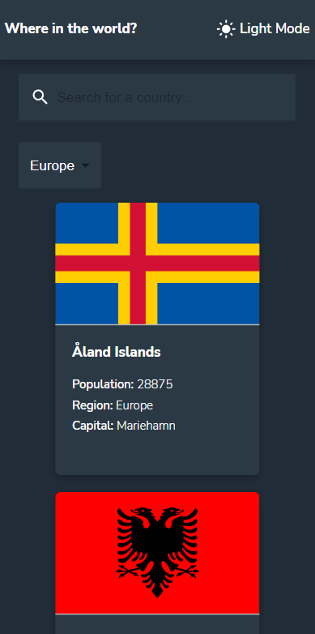
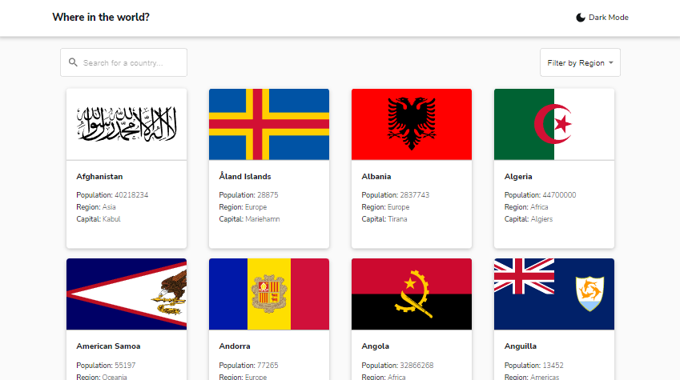

# Rest Countries Api
Rest Countries Api is based on [Frontend Mentor](https://www.frontendmentor.io/home) challenge design. It is my first project with Tailwind CSS, but for sure not last. 

## Table of contents
* [General info](#general-info)
* [Technologies](#technologies)
* [Live demo](#live-demo)
* [Screenshots](#screenshots)

## General info
This app is a good source of information about every country all over the world. Some of them will shock you. Try and explore the world.

## Technologies
* TypeScript
* React
* React Router
* Redux
* Tailwind CSS
* Vite

## Live demo
[Click here](https://mobbyschiller.github.io/rest-countries-api/)

## Screenshots

